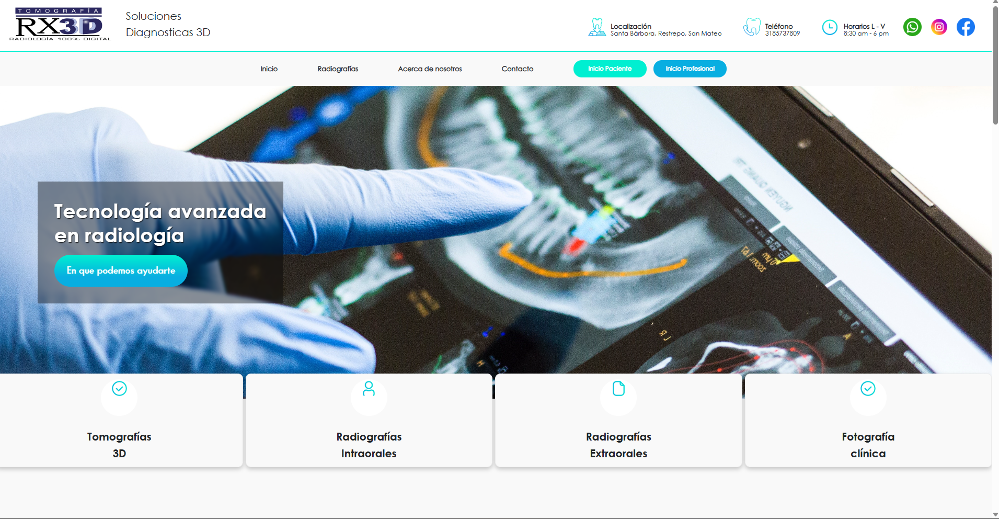
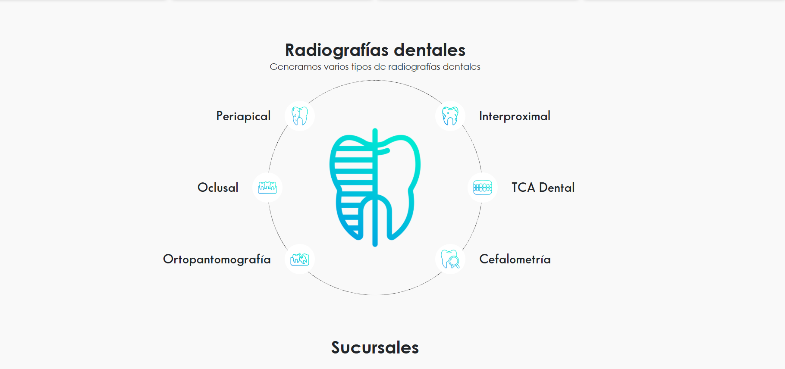
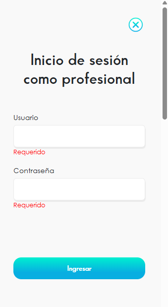
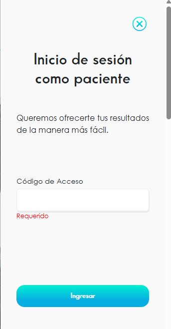

🌐 **Language:** [Español](README.md) | English

# 🩻 RX3D — Management System for a Digital X-Ray Clinic

> Full-featured web system for managing appointments, patients, and medical staff at a 100% digital X-ray clinic.

🔗 **Live client site (Colombia):** [https://tomografiarx3d.com/]

📸 *Due to company confidentiality policy, the source code is not public.*

---

## 📋 Overview

RX3D was built to fully digitize the operational workflow of an X-ray clinic: appointment management, patient records, medical staff control, and user administration, all under a role-based access scheme (patient / doctor / admin).

## 👨‍💻 My Role

I was the **lead backend developer** on this project (working solo on this layer), responsible for:

- Designing and developing **REST APIs** for communication between the frontend and the database.
- Full CRUD modules (create, edit, update, delete) for:
  - Doctors
  - Appointments
- **Authentication and access control** system with role-based access:
  - Patients (unique ID / access code)
  - Doctors (unique ID / username and password)
- **User administration** features (adding/removing patients and doctors) as the system's admin.
- Minor frontend involvement (small contribution; the main focus was backend).

## 🛠️ Tech Stack

| Category | Technology |
|---|---|
| Language | C# |
| Framework | Blazor |
| Additional Frontend | JavaScript |
| Database | SQL Server |
| Architecture | REST API |

## 📸 Screenshots

<table>
  <tr>
    <td align="center"><b>Home Page</b></td>
    <td align="center"><b>X-Ray Types</b></td>
  </tr>
  <tr>
    <td></td>
    <td></td>
  </tr>
  <tr>
    <td align="center"><b>Professional Login</b></td>
    <td align="center"><b>Patient Login</b></td>
  </tr>
  <tr>
    <td align="center"></td>
    <td align="center"></td>
  </tr>
</table>

## 🔒 Note on Source Code

Due to the confidentiality policy of the company this system was built for, the source code cannot be published. This repository documents the project as a case study, with screenshots of the working product and a link to the live site.

---

📩 Questions about this project? Contact me: andymtya93@gmail.com
